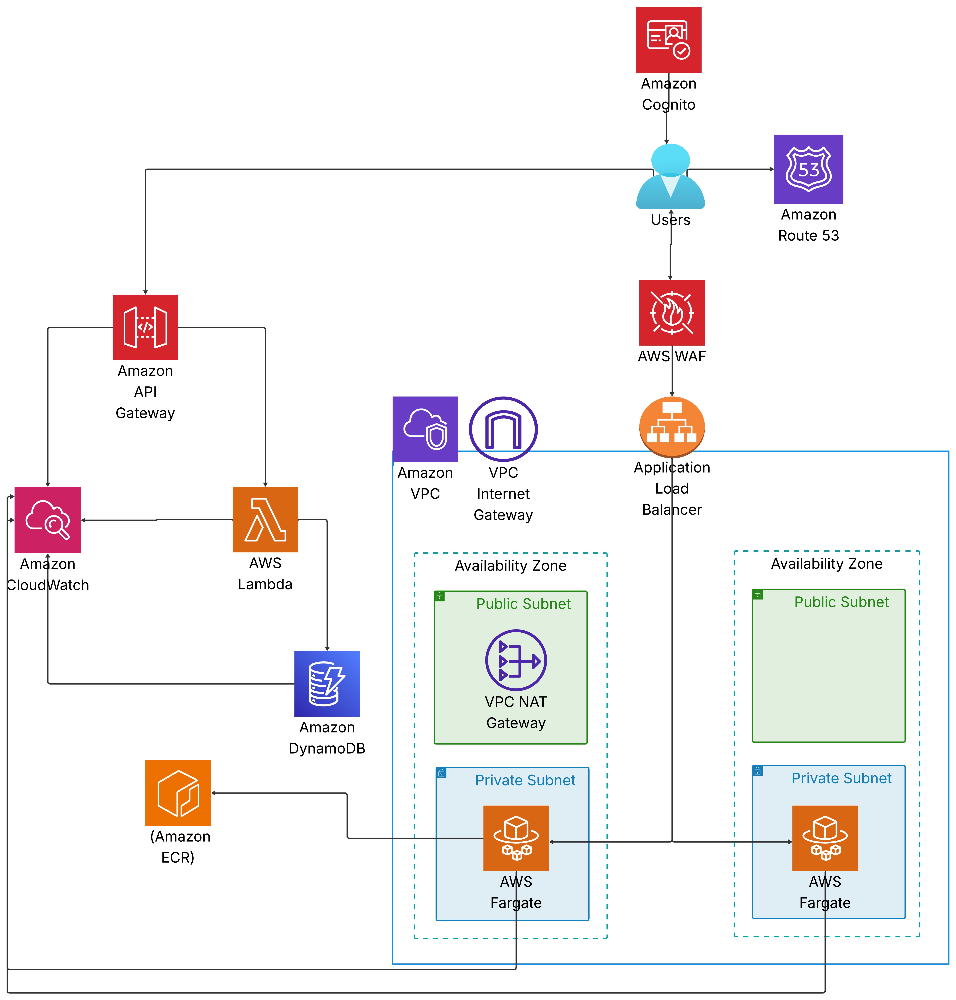
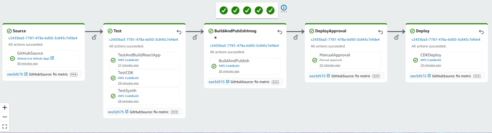
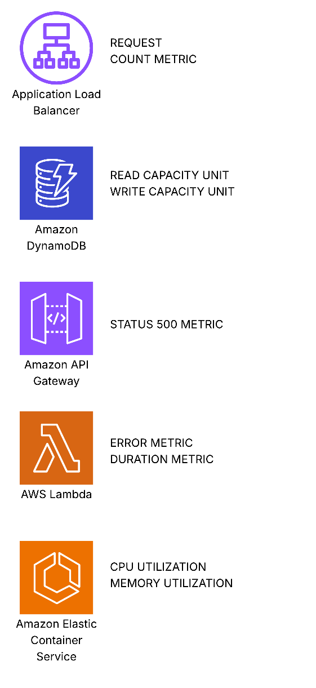

# Internship Task: Automated Deployment of a Full-Stack Serverless Application  

📌 **Levi9 Internship Task**  

## 🚀 Overview  
This project demonstrates a fully automated deployment of a **full-stack serverless application** using AWS services, provisioned via **AWS CDK (Python)** and delivered through **CI/CD pipelines**.  

- **Frontend** is containerized and runs on **AWS ECS Fargate**  
- **Backend** is serverless and built with **API Gateway**, **AWS Lambda**, **Cognito**, and **DynamoDB**  
- **Docker images** are stored in a private **ECR repository** and pulled securely by ECS tasks  
- **IAM roles** ensure least-privilege access between AWS services  
- **CloudWatch** provides centralized monitoring, metrics, alarms, and dashboards  

---

## 🏗️ Architecture Diagram 

 

## 🏗️ AWS Services Overview  

- **Amazon VPC** – Provides isolated networking with public and private subnets, NAT gateways, and secure communication. 
- **Amazon Route 53** – Provides DNS routing for users to reach the application.  
- **AWS WAF** – Web Application Firewall for protecting the frontend from malicious requests.  
- **Application Load Balancer (ALB)** – Distributes incoming traffic across ECS Fargate tasks.  
- **Amazon ECS Fargate** – Runs the frontend application in containers without managing servers; containers pull Docker images from **Amazon ECR**.  
- **Amazon ECR (Elastic Container Registry)** – Stores Docker images securely for ECS tasks. 
- **Amazon Cognito** – Manages user authentication and registration with user pools and app clients.  
- **Amazon API Gateway** – Provides a RESTful API to expose Lambda functions to the frontend.  
- **AWS Lambda** – Serverless backend functions. 
- **Amazon DynamoDB** – NoSQL database for storing application data.  
- **Amazon CloudWatch** – Monitors application logs, metrics, and triggers alarms for ECS, Lambda, API Gateway, and DynamoDB.  

---

## ⚙️ CI/CD with CodePipeline  

 

---

## 📊 Monitoring & Alarms 

 

CloudWatch dashboard and alarms for key application components:

### Lambda
- **Duration** – Average execution time
- **Errors** – Counts `"error"` in logs
- **Dashboard widgets** for duration and errors per function  

### API Gateway
- **5XX Errors** – Alarm on any server error (HTTP 500)  
- **Latency** – Alarm if average latency > 2000 ms  
- **Dashboard widgets** for errors and latency  

### DynamoDB
- **Read Capacity Units** – Alarm if > 100  
- **Write Capacity Units** – Alarm if > 100  
- **Throttled Requests** – Alarm on any throttling  
- **Dashboard graphs** for read/write capacity and throttling  

### ECS Fargate
- **CPU Utilization** – Alarm if > 80% for 10 min  
- **Memory Utilization** – Alarm if > 80% for 10 min  
- **Dashboard widgets** for CPU/memory and alarm status  

### ALB
- **Request Count** – Graph widget for incoming requests per minute  

### Notifications
- API Gateway 5XX alarms trigger **SNS notifications**  
- Other alarms can be linked to **SNS or CloudWatch actions**

## ✅ Summary  
The automated deployment ensures:  
- **Scalability** through serverless and container-based architecture  
- **Security** via VPC isolation, IAM least-privilege, and managed identity with Cognito  
- **Reliability** through CI/CD pipelines and automated provisioning with AWS CDK  
- **Visibility** with CloudWatch metrics, alarms, and dashboards  

This solution showcases end-to-end automation of a cloud-native, full-stack application using AWS best practices.  
